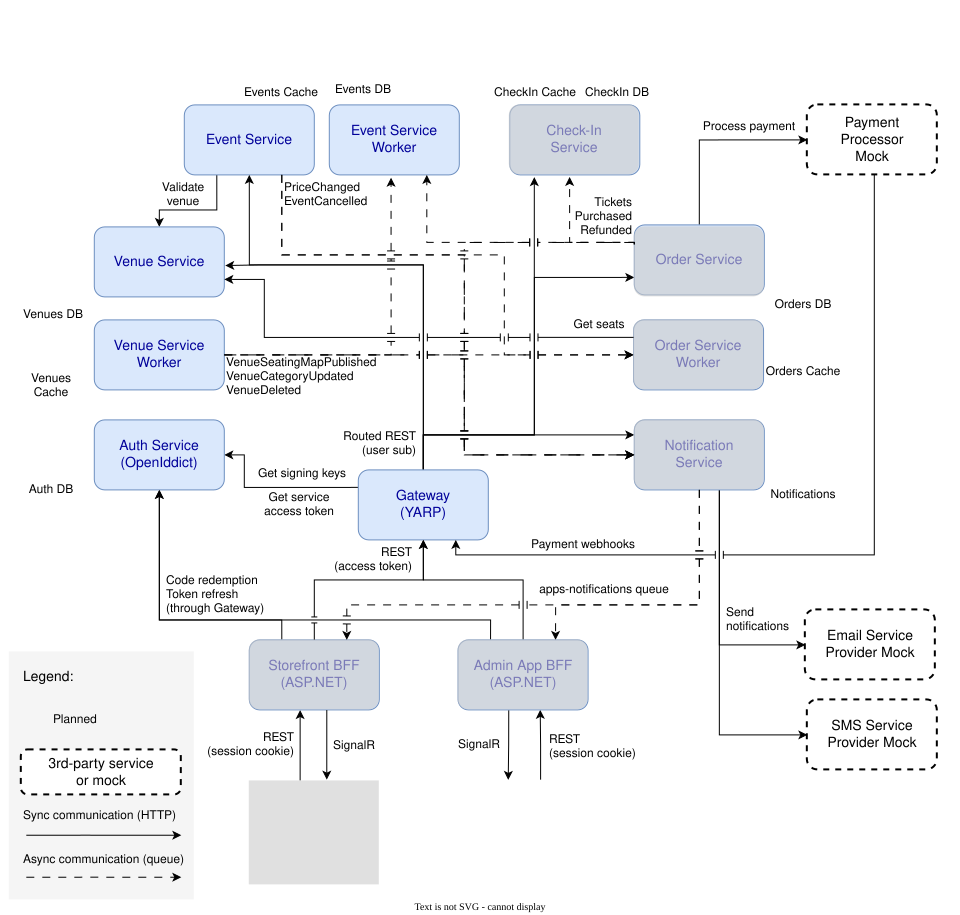

# TixTapGo

A distributed event-ticketing platform built on .NET 10, Aspire and React  - a hobby project, not intended for production use (yet 😅)

> **Current status: work in progress.** The platform foundation (auth between services, gateway, messaging, persistence)
> and some business services are working. End-user authentication, ordering and the client apps
> aren't there yet. I am building it in spare time. See the [status table](#status) and [Known Limitations](KnownLimitations.md).

It aims to support the following use cases:

- Venue management: creating and editing venues, seat categories (VIP, Balcony, etc.), versioned seating maps, importing seats from an excel spreadsheet;
- Event management: registering new events at venues, setting up independent pricing for seat categories;
- Ticket purchase, including refunds, compensating transactions, and oversell protection (payment services mocked);
- Check-in;
- Notifications for admins and attendees about important changes.

---

## Architecture



Solid arrows are synchronous HTTP; dashed arrows are messages over RabbitMQ (MassTransit), always published through a
transactional outbox. Everything except the client apps and the CLI (services, workers, BFFs, databases, broker, cache and migrations) is
orchestrated by the Aspire.

| Component | Responsibility |
|---|---|
| **Gateway** | Public entry point. Routes requests to services with service discovery. Currently attaches an internal access token; doesn't validate end-user tokens yet - that'll come with the BFFs. Hosts the combined API reference (Scalar). |
| **Auth Service** | OpenIddict authorization server. Issues client-credentials tokens for service-to-service calls and seeds client apps from AppHost-managed secrets. |
| **Auth Service CLI** | Admin console tool: list, register and delete client apps, rotate secrets. |
| **Venue Service** | Venues, seat categories, versioned seating maps and seats (bulk import from an Excel template). Owns the seat map. |
| **Event Service** | Events, event lifecycle, per-category pricing and capacity. Keeps a local copy of venue seat categories, updated from Venue Service messages. |
| **Order Service** | Owns ticket purchases, refunds, and integration with a (mocked) payment provider. Orchestrates seat reservations and compensation when a payment fails. Keeps a local copy of seats and event category prices. |
| **Check-In Service** | Handles attendee check-ins. Detects duplicate and forged tickets. Designed for fast ticket lookups and scalability (pre-warmed cache). Keeps a local copy of tickets sold. |
| **Notification Service** | Turns integration events into notifications for admins and attendees; delivers them through several channels: email and SMS (mocked), and in-app. |
| **Workers** | Background processing per service: message consumers (Venue Service) and recurring Hangfire jobs such as expiring past events and cancelling events with unresolved issues (Event Service). |
| **Backend for Frontend (BFF)** | Serves client web apps (admin and storefront). Owns the OIDC login flow; refreshes tokens; maps the session cookie to the user's access token; aggregates and caches complex request results; pushes real-time in-app messages with SignalR. |
| **Shared.\*** | Cross-cutting building blocks: base entity conventions, soft delete, domain events → outbox, idempotency, auth helpers. |
| **Admin App** | Admin authentication, venue and event management, resolving issues. |
| **Storefront App** | Attendee authentication, event listings, ticket purchase and refunds. |

## Status

| Area | Component | Status | Notes |
|---|---|---|---|
| Platform | Aspire AppHost, ServiceDefaults | Working | OpenTelemetry, health checks, resilience, service discovery, automatic EF migrations |
| Platform | Gateway | Working | YARP routing and internal token injection. Edge authentication for end users is planned (see BFF) |
| Identity | AuthService + CLI | Partial | Service-to-service (client credentials) done. End-user login and scopes planned |
| Venues | VenueService + Worker | Working | Venues, seat categories, seating map versions (draft → publish), Excel seat import |
| Events | EventService + Worker | Working | Event lifecycle, category pricing with capacity checks, reactions to venue changes, scheduled jobs |
| Shared | Persistence / Auth / Shared libs | Working | Outbox, soft delete, concurrency tokens, Redis-backed idempotency |
| Clients | Admin app (React) | Early | App shell, i18n, theme. Venues page currently uses mock data |
| Edge | BFFs (admin, storefront) | Planned | One cookie-session BFF per app on a shared library; user tokens forwarded to services; real-time notifications (SignalR) |
| Sales | OrderService + Worker | Planned | Seat holds with TTL, purchase saga, idempotent payment confirmation |
| Comms | NotificationService | Planned | Consumers fanning out order, event-cancellation and disruption messages |
| Access | CheckInService | Planned | Ticket scanning and entry validation |
| Clients | Storefront app (React) | Planned | Public event browsing and ticket purchase |

## Implementation notes

### Transactional outbox driven by domain events

Entities queue domain events. A `SaveChanges` interceptor publishes them into MassTransit's EF Core outbox, so business
changes and outgoing messages are committed atomically.
([`DomainEventsInterceptor`](src/backend/TixTapGo.Shared.Persistence/DAL/DomainEventsInterceptor.cs),
[`ConfigurationExtensions`](src/backend/TixTapGo.Shared.Persistence/DAL/ConfigurationExtensions.cs))

- DbContext pooling is deliberately disabled - it breaks outbox delivery.
- `IBusControl` is registered by hand since the Aspire MassTransit toolkit's registration doesn't include it.

### Cross-service consistency for seat categories

VenueService owns seat categories; EventService prices them. When a seating map is published, the worker sends a full
category snapshot with capacities, and EventService reconciles its local copy
([`VenueServiceQueueConsumer`](src/backend/TixTapGo.EventService/Integrations/InternalServices/VenueService/VenueServiceQueueConsumer.cs)):

- Categories that shrank below the capacity already assigned to upcoming events disable the affected prices and
  raise an `EventDecisionRequired` issue on the event.
- Removed categories that are still in use are marked `PendingRemove` instead of deleted, so no data disappears
  without a decision.
- Issues left unresolved shortly before an event starts cause the event to be handled by a dedicated job.

### Versioned seating maps with a database-level guarantee

A renovation creates a new seating map version; events keep the version they were created against. Only drafts are
editable, and publishing closes the previous version's validity window. A deferrable PostgreSQL exclusion constraint
(`EXCLUDE USING gist` over `tstzrange`) makes overlapping published versions impossible.

### Idempotency keys backed by Redis

Endpoints opt in with `.WithIdempotencyCheck()`.
([`IdempotencyStateManager`](src/backend/TixTapGo.Shared.Persistence/DAL/Idempotency/IdempotencyStateManager.cs))

- The first request claims the key with an atomic `SET NX` "Processing" marker, which blocks duplicates across
  instances. A concurrent duplicate gets `409`.
- The finished response (status, headers, body) is cached for 24 hours and replayed with an `Idempotency-Replayed` header.
- Error responses are replayed too: a key represents one logical attempt (Stripe's API model).

### Hierarchical soft delete that follows EF Core delete behaviors

Removing an entity turns into a soft delete that walks the EF model's foreign keys:

- `Cascade` soft-deletes dependents; `SetNull` clears foreign keys; `Restrict` blocks the delete.
- Composite keys are supported.
- Relationships with no back-navigation are resolved through reflection.

Query filters and filtered unique indexes are applied by a model convention.
([`HierarchicalSoftDeleteCommand`](src/backend/TixTapGo.Shared.Persistence/DAL/HierarchicalSoftDeleteCommand.cs),
[`EntityBaseConvention`](src/backend/TixTapGo.Shared.Persistence/DAL/EntityBaseConvention.cs))

### Service-to-service authentication without shared secrets in config

AppHost generates and persists per-service client secrets and injects them as environment variables. AuthService
creates or updates the matching OpenIddict client apps on startup. Services validate tokens locally, and a fallback
authorization policy only lets in known client ids.
([`ClientSeeder`](src/backend/TixTapGo.AuthService/ClientSeeder.cs),
[`AddInternalOnlyAuthorization`](src/backend/TixTapGo.ServiceDefaults/Extensions.cs))

## Tech stack

**Backend:** .NET 10 (C# 14), ASP.NET Core (Minimal API), EF Core 10 + Npgsql (PostgreSQL), Aspire, YARP, OpenIddict, MassTransit
(RabbitMQ, EF outbox), Redis, SignalR, Hangfire, Mapperly, ClosedXML, OpenTelemetry, Scalar.

**Frontend:** React 19, TypeScript, Vite, MUI, TanStack Query, Zustand, i18next. Organized with Feature-Sliced Design.

**Testing:** xUnit, Testcontainers (PostgreSQL, Redis).

**Build settings:** central package management, nullable warnings as errors, analyzers, code style enforced at build time.

## Running locally

### Prerequisites

- .NET SDK 10.0.3xx
- Docker Desktop (running)
- Node.js 22+ (client apps only)
- Optional: [Aspire CLI](https://learn.microsoft.com/dotnet/aspire/cli/overview)

### Backend

```bash
# with the Aspire CLI
cd src/backend/TixTapGo.AppHost
aspire run

# or with plain dotnet
dotnet run --project src/backend/TixTapGo.AppHost
```

On first start, the Aspire dashboard asks for two parameters:

| Parameter | Value |
|---|---|
| `local-postgres-password` | Any password for the local PostgreSQL container |
| `client-credentials-encryption-key` | A base64-encoded 32-byte key. The parameter description in the dashboard shows a freshly generated one you can paste |

Service client secrets are generated and persisted automatically. Migrations run before the services start.

Once everything is healthy:

- **Aspire dashboard:** URL printed in the console (resources, logs, traces)
- **API reference (Scalar):** `https://localhost:7177/scalar`
- **RabbitMQ management and RedisInsight:** links in the Aspire dashboard

### Admin app

```bash
cd src/frontend/admin-app
npm install
npm run dev
```

### Tests

```bash
dotnet test src/backend/TixTapGo.slnx   # requires Docker (Testcontainers)
```

## Known limitations / TODOs

The platform's still under development, so there are some gaps and deferred issues. They're listed in
[KnownLimitations.md](KnownLimitations.md).
